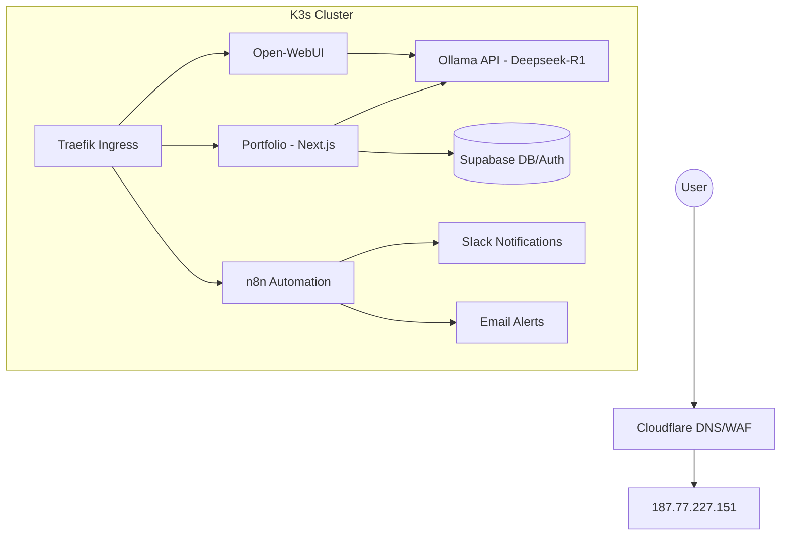

# 🧠 JPGLabs Portfolio & AI Hub — Documentation

## 🏗 Architecture Overview

The system is a self-hosted **AI Orchestration Hub** running on a single-node **k3s (Kubernetes)** cluster. It integrates a professional portfolio with a SaaS-ready AI resume parser and a fleet of automated agents.

### 🌐 System Diagram



---

## 🚀 Frontend (Portfolio)

- **Framework:** Next.js 14 (App Router)
- **Styling:** Tailwind CSS + Framer Motion (for "Visionary Operator" animations)
- **Features:**
  - **Dynamic Identity:** Auto-populated from professional history.
  - **Implementation Patterns:** Abstracted production patterns (LGPD, persistence mapping, auth flows) documented without exposing proprietary source code.
  - **Resume Parser (SaaS):** Drag-and-drop PDF/TXT upload → Ollama extraction → Instant instantiation.

---

## ⚙️ Backend & API

The backend is integrated into the Next.js API Routes, providing a "headless" approach for the SaaS features.

### 📖 API Reference (Swagger-style)

| Endpoint | Method | Description | Payload |
| :--- | :--- | :--- | :--- |
| `/api/resume/parse` | `POST` | Parses resume via Ollama | `{ text: string }` |
| `/api/auth/[...nextauth]` | `GET/POST` | Handles OAuth (Google/Github) | Session cookie |
| `/api/portfolio/generate` | `POST` | Saves generated data to Supabase | `PortfolioSchema` |

---

## 🤖 AI & Automations

### Ollama (Deepseek-R1)
- **Namespace:** `ai-services`
- **Model:** `deepseek-r1:7b`
- **Purpose:** Handles complex resume parsing and code explanation.

### n8n Workflow Fleet
1.  **Infrastructure Monitor:** Health checks for all domains every 5 mins.
2.  **WhatsApp Bot:** Secure chatbot with HMAC validation and rate limiting.
3.  **Kiwify Delivery:** Secured delivery pipeline with idempotency.

---

## 📦 Deployment & Ops

### CI/CD Pipeline
- **GitHub Actions:** `.github/workflows/deploy.yml`
- **Build:** Docker images built directly on VPS to optimize for local architecture.
- **Orchestration:** `kubectl rollout restart` for zero-downtime updates.

### Monitoring
- **Slack:** Real-time alerts for service downtime.
- **Email:** Redundant notifications for critical failures.

---

## 🛠 Project Structure

```text
portfolio/
├── app/                # Next.js App Router
├── components/         # UI Components (Hero, ResumeUpload, etc.)
├── k8s/                # Kubernetes Manifests
├── lib/                # Shared utilities (ollama, supabase)
├── public/             # Static assets
└── Dockerfile          # Multi-stage production build
```
